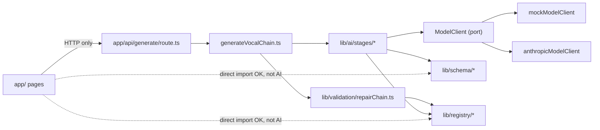

# Architecture Spine — VocAligner

## Design Paradigm

**Pipeline (Pipes-and-Filters)** for the AI generation core, with **Ports & Adapters** at the one place it talks to the outside world (the AI provider), inside a conventional **Next.js App Router** delivery layer.

| Layer | Namespace | Role |
| --- | --- | --- |
| Delivery | `web/app/**` (pages, `app/api/generate/route.ts`) | Only entry point for users and the only caller of the pipeline |
| Pipeline (filters) | `web/lib/ai/stages/*` | Research → Reasoning → Generation, each a pure async function over the model port |
| Validation gate | `web/lib/validation/repairChain.ts` | Sits after the pipeline, before any result leaves the orchestrator |
| Orchestration | `web/lib/ai/generateVocalChain.ts` | Composes stages + validation gate + retry; the pipeline's composition root |
| Port + Adapters | `web/lib/ai/modelClient.ts` (+ `mockModelClient.ts`, `anthropicModelClient.ts`) | The one swappable boundary to an external AI provider |
| Domain data | `web/lib/schema/*`, `web/lib/registry/*`, `web/lib/domain/*` | Contracts flowing through the pipeline; the closed world generation is constrained to |

## Invariants & Rules



### AD-1 — App-derived bookkeeping fields are never asked of the model, and only one place renumbers them `[ADOPTED, corrected]`
- **Binds:** `lib/ai/stages/*`, `generateVocalChain.ts`, `lib/validation/repairChain.ts`
- **Prevents:** the model being asked to produce a field the app should compute deterministically (and getting it wrong); two stages disagreeing on who owns an id/ordering field; a future repair-by-removal feature leaving `order` non-contiguous after dropping a plugin instance.
- **Rule:** A stage's model-facing request schema omits any field the app derives (e.g. `generationStage` omits `order`/`wasRepaired`; `reasoningStage` omits `id`) and computes/attaches that field itself, immediately after its own model call returns — this is what the code does today (`order` is assigned inside `generationStage.ts`, not by a separate orchestrator pass). Any future code that changes `plugins[]`'s cardinality (e.g. `repairChain.ts` dropping an invalid instance instead of rejecting the whole chain) must renumber `order` in that same place, before returning — bookkeeping ownership always sits with whichever code last changed the shape, never split across two steps.

### AD-2 — `ModelClient` is the only AI-provider boundary `[ADOPTED]`
- **Binds:** all code that needs an AI completion
- **Prevents:** a new feature importing `@anthropic-ai/sdk` (or any other provider SDK) directly, bypassing retry policy, observability, and error normalization.
- **Rule:** Only `lib/ai/*ModelClient.ts` files may import a provider SDK. Everything else depends on the `ModelClient` interface, obtained via `getModelClient()`.

### AD-3 — Validation gate is the hard boundary before anything is returned `[ADOPTED]`
- **Binds:** `generateVocalChain.ts`, `repairChain.ts`, `app/api/generate/route.ts`
- **Prevents:** an invalid or partially-invalid chain reaching a user, being cached, or ambiguity about which problems are auto-fixed vs. fatal.
- **Rule:** `validateAndRepairChain` classifies every issue as `valid`, `repaired` (numeric out-of-range → clamp, continue), or `rejected` (unknown plugin/control → discard, retry generation up to the orchestrator's retry limit). Only a `valid` or `repaired` chain may leave `generateVocalChain`; a `rejected` candidate never does. **Scope note:** this classification is exhaustive only for what's implemented today — numeric range-checks and plugin/control existence-checks. String/boolean control *value* validation doesn't exist yet (see Deferred); it is deliberately not specified here until it's actually built, rather than guessing a repaired/rejected split for a feature that isn't real.

### AD-4 — Schema is the single source of truth `[ADOPTED, narrowed]`
- **Binds:** `lib/schema/*` and every consumer of a domain type
- **Prevents:** a hand-written TS interface drifting from the runtime validation that actually runs.
- **Rule:** Every domain type is defined once as a Zod schema; its TS type is always `z.infer<typeof schema>`, never hand-declared separately. *(Note: an earlier draft of this AD also mandated barrel-only imports via each module's `index.ts`. Dropped — the codebase deep-imports everywhere today, `lib/ai/index.ts` doesn't even export what its one real consumer needs, and no lint rule enforces it. Not ratified reality; not reintroduced without an actual migration + enforcement plan.)*

### AD-5 — Plugin Registry is the closed world generation is constrained to `[ADOPTED]`
- **Binds:** `lib/registry/*`, `generationStage.ts`, `repairChain.ts`
- **Prevents:** a generated chain referencing a plugin or parameter that doesn't exist in Logic Pro, or a second, drifting list of "what plugins exist" appearing elsewhere (e.g. hardcoded into a prompt).
- **Rule:** `pluginRegistry`, keyed by `{daw, tier}`, is the only source of valid plugins/controls. New plugins are added as entries in `logicPro.ts`, never hardcoded into a prompt or stage. `Daw` is currently the closed enum `["logic-pro"]` — adding a DAW is a deliberate schema + registry change, not a runtime-open plugin mechanism. **Every entry in `logicPro.ts` must have `tier: "stock"`** — `pluginTierSchema`'s other members (`free-3rd-party`, `commercial`) are reserved for a future, deliberately-scoped DAW/tier expansion and must not appear in this file until that expansion is actually planned.

### AD-6 — Design tokens are centralized `[ADOPTED, tightened, refreshed 2026-07-24]`
- **Binds:** `web/app/globals.css`, all UI components
- **Prevents:** a component hardcoding a color/gradient that drifts from the Design System.
- **Rule:** All color/gradient values are defined once as CSS custom properties in `globals.css`. Two consumption patterns, both sanctioned:
  1. Simple flat colors are wired through Tailwind's `@theme inline` and consumed via semantic classes (`text-foreground`, `text-muted`, `text-supporting`, `bg-background`, `text-brand-accent`/`bg-brand-accent`, `hero-gradient`).
  2. Multi-stop gradients (e.g. the landing hero's white→gold→purple wash, the "Meet VocAligner" section's purple-to-near-black) are **not** expressible as Tailwind utilities — these are sanctioned to be read directly as CSS custom properties via an inline `style={{ background: "linear-gradient(... var(--wash-purple) ...)" }}`, not hardcoded color values. This is still "the token," just consumed differently.

  Either way: **never a raw Tailwind palette utility** (`zinc-*`, `black/`, `white`, etc.) and never a raw hex value in component code. A new visual need gets a `--color-*` (or plain `--`) token in `globals.css` first, then consumed one of the two sanctioned ways above.
- **Two easily-confused token pairs — do not conflate:** `--accent` (shadcn's neutral hover/surface color, used by generated `components/ui/*`) vs. `--brand-accent` (the actual VocAligner warm gold — `text-brand-accent`/`bg-brand-accent`); and `--muted` (shadcn's light surface color) vs. the app's own readable-gray `text-muted` (aliased to `--muted-foreground`, not `--muted`). See the comments directly in `globals.css`.
- **Functional pages keep the simple gradient; only the landing page gets the fuller wash.** Per `docs/DESIGN_SYSTEM.md` v1.1: `loading`/`results` pages use the existing plain `hero-gradient` (sunset-to-white); the richer white→gold→purple treatment and the dark "Meet VocAligner" storytelling section are landing-page-only. Don't propagate the new palette to functional pages by default.
- *(Existing pages still have some un-tokenized palette utilities like `border-black/10` — see Deferred; this Rule governs new work, cleanup of existing pages is separate.)*

### AD-7 — Cache key and scope
- **Binds:** FR-4 (Cache), `web/lib/store/generationStore.ts`
- **Prevents:** two independent implementations of caching disagreeing on what counts as "the same request," or building per-user caching that doesn't fit a product with no accounts.
- **Rule:** The cache is **global** — there is no per-user or per-session concept anywhere in the MVP data model (no auth exists), so a per-user cache isn't a coherent option yet. The cache key is the normalized pair `(normalize(Artist Input), normalize(Song Input))`, where `normalize` is: trim, lowercase, Unicode-canonicalize (`.normalize("NFC")`), and collapse internal whitespace runs to a single space. No fuzzy/typo matching in MVP — normalization only collapses text that is genuinely the same (identical letters, different encoding or spacing), never different spellings. *Resolves PRD Open Questions 1 and 2. Widened 2026-08-02 (Story 2.1 code review) from the original "trim + lowercase" wording to also cover Unicode normalization form and internal whitespace, both of which produce visually-identical text a user would reasonably expect to hit the same cache entry — see `web/lib/store/generationStore.ts`'s `normalizeText`.*

### AD-8 — Cache entries are versioned, not just keyed by input
- **Binds:** the cache layer, `PIPELINE_VERSION`, `PROMPT_VERSION`, `CURRENT_SCHEMA_VERSION`
- **Prevents:** a prompt tweak, pipeline restructure, or response-schema change silently serving stale chains generated under a different (and now-superseded) system.
- **Rule:** A cache lookup must match on `(Artist + Song key, PIPELINE_VERSION, PROMPT_VERSION, CURRENT_SCHEMA_VERSION)` together — not the artist/song key alone. Bumping any of the three versions invalidates old cache entries for the same input. *Widened 2026-08-02 (Story 2.1 code review) to check `CURRENT_SCHEMA_VERSION` explicitly, rather than relying on the convention that a schema-shape change always bumps `PIPELINE_VERSION` too — that convention is documented on `PIPELINE_VERSION` itself but wasn't code-enforced.*

### AD-9 — The AI pipeline is reached only through the API route
- **Binds:** `web/app/**`, `web/lib/ai/**`
- **Prevents:** a page or client component importing `lib/ai/*` directly — which would either leak the Anthropic API key into the browser bundle or duplicate validation/retry logic outside the route. Formalizes the existing `CLAUDE.md`/`ARCHITECTURE.md` rule ("AI requests always server-side") as an enforceable dependency direction.
- **Rule:** Only `app/api/generate/route.ts` (and its own tests) may import from `lib/ai/*`. Pages/components reach generation exclusively over HTTP via that route. Pages/components may import `lib/registry/*` and `lib/schema/*` directly — that's shared domain data, not AI execution.

### AD-10 — Cross-page result handoff is by opaque id; cache stores and replays the whole response
- **Binds:** `app/loading/page.tsx`, `app/results/page.tsx`, the FR-4 cache layer, `app/api/generate/route.ts`
- **Prevents:** three otherwise-plausible, mutually incompatible builds of the loading→results handoff — serializing a full `VocalChainResponse` into a URL (breaks at realistic size, leaks generation content into browser history/server logs), inventing an undocumented ad hoc client-side store, or having the results page silently re-POST and depend on FR-4 shipping first with no stated dependency. Also prevents two different answers to "does a cache hit get a new `id`/`generatedAt` or the original ones."
- **Rule:** The loading page passes only `?id=<generation id>` to `/results` — never the full response. `results/page.tsx` is the only page that reads a full `VocalChainResponse`, fetched by that id from the same store FR-4 introduces (e.g. a `GET /api/generate/[id]`-shaped route). That store holds complete `VocalChainResponse` objects, keyed both by generation `id` and by the AD-7 cache key. A cache hit (same Artist+Song, same `PIPELINE_VERSION`/`PROMPT_VERSION`) returns the originally-stored response unmodified except `meta.cacheHit` set to `true` — `id` and `generatedAt` are never regenerated on a hit. The cache sits in front of `generateVocalChain.ts` (checked by the route or a thin wrapper before any stage runs), not inside it.

## Consistency Conventions

| Concern | Convention |
| --- | --- |
| Naming | camelCase for `.ts` modules and functions; PascalCase for React components; test files colocated as `foo.test.ts` next to `foo.ts` |
| Data & formats | Zod schema-first everywhere; TS types via `z.infer`; domain errors are `Error` subclasses with `this.name` set explicitly (`errors.ts`); generation ids via `randomUUID()` |
| State & cross-cutting | No global frontend state store — simple form state (artist/song) crosses pages via URL query params; a full generation result crosses pages only by id, per AD-10; transient/transport retries live only inside the relevant `*ModelClient.ts` adapter; malformed-output retries live only in the orchestrator (`generateVocalChain.ts`) — never duplicate retry logic in both places |
| Observability | Stages report via the optional `ObserveStage` callback (`{durationMs, usage, retryCount}`), keeping each stage's return type a clean domain type — never bake observability into a stage's return value. *(Plumbed into every stage today; `generateVocalChain.ts` doesn't yet pass a consumer — see Deferred.)* |

## Stack

*Ratified from `web/package.json` — brownfield reality, not re-selected.*

| Name | Version |
| --- | --- |
| Next.js (App Router) | 16.2.10 |
| React / react-dom | 19.2.4 |
| TypeScript | 5.x (strict mode) |
| Zod | 4.4.3 |
| @anthropic-ai/sdk | 0.110.0 |
| Tailwind CSS | 4.x |
| Vitest | 4.1.10 |
| ESLint | 9.x (flat config) |
| shadcn/ui (Nova preset, Base UI primitives) | 4.14.0 — scaffolding only as of 2026-07-24; not yet used by any real page, added during landing-page design exploration |
| `motion` (Motion, formerly Framer Motion) | 12.42.2 — import from `"motion/react"`, not `"framer-motion"` |
| `@base-ui/react`, `class-variance-authority`, `clsx`, `lucide-react`, `tailwind-merge`, `tw-animate-css` | shadcn/ui's supporting dependencies |

## Structural Seed

```text
web/
  app/                    # Next.js App Router — pages + API routes (the only delivery surface)
    api/generate/         # route.ts — the ONLY caller of lib/ai
    components/           # shared reusable UI (e.g. Wordmark)
  lib/
    ai/
      stages/             # research, reasoning, generation — the pipeline filters
      prompts/            # per-stage prompt builders + PROMPT_VERSION
      modelClient.ts       # the port
      mockModelClient.ts   # adapter: deterministic, no network
      anthropicModelClient.ts # adapter: real provider (built, not yet wired via getModelClient)
      generateVocalChain.ts  # orchestrator: composes stages + validation + retry
      getModelClient.ts     # the mock/live switch point — currently hard-returns the mock client
      pipelineVersion.ts   # PIPELINE_VERSION
      observability.ts     # ObserveStage contract
      errors.ts            # ModelResponseValidationError, ModelTransportError
    schema/                # Zod schemas + inferred types (research, reasoning, chain, vocalChain, validationResult)
    registry/              # pluginRegistry + logicPro.ts stock-plugin data
    domain/                # cross-cutting enums (Daw, PluginTier)
    validation/            # repairChain.ts — the validation gate
```

## Capability → Architecture Map

| FR | Lives in | Governed by |
| --- | --- | --- |
| FR-1 (Submit a Generation request) | `app/page.tsx` | AD-9 |
| FR-2 (Research before generating) | `lib/ai/stages/researchStage.ts` | AD-1, AD-2 |
| FR-3 (Registry-constrained generation) | `lib/ai/stages/generationStage.ts`, `lib/validation/repairChain.ts` | AD-1, AD-3, AD-5 |
| FR-4 (Cache) — not yet built | new cache layer between `app/api/generate/route.ts` and `generateVocalChain.ts` | AD-7, AD-8, AD-10 |
| FR-5 (Fail clearly) | `generateVocalChain.ts` (`VocalChainGenerationError`), `app/api/generate/route.ts` | AD-3 |
| FR-6 / FR-7 (Plugin Visuals, literal values) — not yet built | `app/results/page.tsx`, fetched by id per AD-10 | AD-5, AD-6, AD-10 |

## Deferred

- **DeEsser 2 settings are never generation targets.** Per PRD §8.9: Threshold, Max Reduction, and Frequency always render at Logic's own defaults, faded — the reasoning/generation stages should never be prompted to vary them per song. Only whether DeEsser 2 appears in the chain at all is a real reasoning-stage decision; its specific numeric settings are not. Implementation note for whenever the real pipeline touches this: simplest path is to never include DeEsser 2's controls in a generated `PluginInstance.controls[]` at all (the existing sparse-array/registry-default-fallback pattern already used for untouched Channel EQ bands handles this with no schema change) rather than generating-then-ignoring a value.
- **"Standard practice" badge, not a separate results-page section.** Per PRD FR-6: a plugin whose settings are never researched (currently only DeEsser 2) stays in its true signal-chain position on the results page and just carries a small "Standard practice" label on its own card. Considered and rejected: physically regrouping such plugins into a separate section, which breaks the "list order = signal-chain order" guarantee FR-6 depends on unless each plugin's true chain position is re-displayed a second time to stay safe to rebuild from — not worth the added complexity for what a card-level label already communicates. No registry/schema change for this — it's a Plugin Visual component-level concern (currently only `DeEsser2Visual.tsx` needs it); don't build a generic registry-wide flag for a single case.
- **Deployment target & environments.** Nothing decided yet beyond `next dev`/local — no hosting provider, no staging/prod split, no CI/CD config exists. Matches the founder's stated near-term priority ("works locally first"). Revisit before Milestone 8 (public beta).
- **Cache storage technology.** AD-7/AD-8/AD-10 fix the key, versioning, and what's stored; *where* it's physically stored (in-memory, Redis, a DB) is open. `docs/ROADMAP.md`'s pending "Database" item suggests one's coming, but which isn't decided.
- **Rate-limiting / abuse-prevention mechanism.** Confirmed non-goal for MVP (PRD §5); revisit alongside the live-Anthropic cutover, since that's when unmetered requests start costing real money per call.
- **Confidence Score product surfacing.** `lib/schema/chain.ts`'s `controlValueSchema` already carries a per-control `confidence` field (`low`/`medium`/`high`) that no UI currently reads. The PRD treats Confidence Score as a from-scratch future feature — worth a look before assuming it needs new plumbing.
- **`PluginTier` scope.** The enum already includes `free-3rd-party` and `commercial` alongside `stock`, even though product policy is stock-only, permanently (not just MVP). AD-5 now pins `logicPro.ts` to `stock`-only entries; the enum itself is left as-is rather than trimmed, flagging it as a conscious choice next time someone touches the registry.
- **String/boolean control value validation.** AD-3 currently only range-checks numeric controls and existence-checks any control. Validating a string/boolean control's actual *value* (e.g. a mode-select parameter) isn't built. When it is, the repaired-vs-rejected outcome and any new `ControlDefinition` field needed (e.g. an `allowedValues` list) must be decided together, not improvised per contributor.
- **`ObserveStage` consumer.** The callback is plumbed into every stage but `generateVocalChain.ts` doesn't pass one yet — nothing currently logs or measures stage timing/usage/retries in production. Wire a consumer (logging, metrics) when observability actually becomes a need, not before.
- **Un-tokenized Tailwind utilities in existing pages.** `page.tsx`, `loading/page.tsx`, and `results/page.tsx` already use raw palette utilities (`border-black/10`, `bg-zinc-800`, etc.) that AD-6 now disallows for *new* work. Cleaning up the existing three pages is a separate, small follow-up story, not blocked by anything here.
- **Anthropic model id.** `anthropicModelClient.ts` hardcodes `DEFAULT_MODEL = "claude-sonnet-4-5-20250929"`, an active but superseded model. Not an architectural concern, but worth a conscious swap before the live-Anthropic cutover ships.
- ~~**Bespoke per-plugin Plugin Visual designs.**~~ `[MOVED IN-SCOPE 2026-07-29; Channel EQ + Pitch Correction IMPLEMENTED 2026-07-30]` No longer deferred — the founder reversed this after reviewing real Logic Pro screenshots for all 10 registry plugins; a generic knob-grid template didn't read as premium or trustworthy. Each plugin gets a bespoke visual matching its real panel. 8 of the 10 (Compressor, DeEsser 2, ChromaVerb, Tape Delay, Overdrive, Flanger, Phaser, Chorus) stay within the existing flat-control data shape — just styled/proportioned per plugin, no schema change — and are still pending (Story 1.3, Task 1). Channel EQ and Pitch Correction needed real new work, validated through an iterative static-mockup process before component code was written, and are now built (`web/app/components/ChannelEqVisual.tsx`, `PitchCorrectionVisual.tsx`):
  - **Channel EQ** — modeled as 8 real bands (frequency/gain/Q for all 8; bands 1 & 8 additionally have a dB/Octave slope *on top of* their own Q, not instead of it — the real reference's band readout shows three numbers for bands 1/8 too, which an earlier pass of this doc under-specified). A band that generation didn't actually touch is absent from that `PluginInstance`'s `controls[]` array (the existing sparse-array shape already supports this — no new schema field needed) — the visual treats a missing band as neutral/inactive and contributes zero to the rendered curve, never falling back to rendering the registry's stored default value for it. (This distinction — "absent, so inert" vs. "present at its default value" — was the actual root cause of a real rendering bug during the mockup process: computing a disabled band's filter response at its parked default frequency instead of skipping it, which showed up as a curve that wasn't flat even at rest.) The curve itself is computed client-side from real filter-response math (biquad/RBJ Cookbook formulas; a 24dB/Oct slope cascades two 12dB/Oct stages at the band's own Q), not an approximation — deterministic rendering, not something the AI generates. See `docs/plugin-references.md` for the real default band values (pulled directly from a neutral-state Logic screenshot) and `docs/DESIGN_SYSTEM.md`'s Plugin Visual Fidelity Standards for the specific calibration rules this process surfaced (0dB-relative shading, dual-scale axis, log-scale label density/collision handling).
  - **Pitch Correction** — the registry gained `rootNote`/`scale` fields (low fabrication risk — a song's key is a discoverable music fact, not an invented engineering value, unlike most other per-song settings). The keyboard highlights whichever notes are in the researched Root Note + Scale/Chord, computed from the standard interval-pattern table in `docs/plugin-references.md` (42 scale/chord types) — never hardcoded per example. Highlighting uses one flat color for in-scale and one for faded/out-of-scale, identical regardless of a key's natural black/white identity — no per-key tinting. Its `response`/`tolerance` controls were also corrected against the real reference while this field was added (the old entry had an invented `amount`/% control with no real counterpart, and the wrong `response` default).
  - Process note worth reusing if a future plugin needs similarly novel rendering: build a dedicated neutral/rest-state diagnostic view first and verify it's genuinely flat/inert before layering in applied data — this is what caught the Channel EQ "disabled bands still contributing" bug, which would have been much harder to spot directly in an applied example.
- **Plugin Variant selection.** Confirmed future feature (PRD Glossary/§5/§6.2) — e.g. Compressor's Studio FET vs. Vintage Opto, ChromaVerb's algorithm choices. When scoped, this extends `PluginRegistryEntry` with a `variants` list (each carrying a human-authored sonic-character description, same pattern as the existing `education` field), adds a variant-selection field to `PluginInstance`, and extends generation/validation to pick and check it — the same registry-as-closed-world pattern (AD-5) applies, not a new paradigm. Not started; no schema support exists today.
- **Authentication / accounts.** Non-goal until Milestone 6 — no user concept exists anywhere in the current data model (this is *why* AD-7's cache is global, not a placeholder for per-user).
- **"No registry match" behavior.** When research/reasoning identifies a real production technique with no corresponding registry entry (e.g. modulation effects like flanger/chorus — none of the current 6 stock plugins cover this family), the generation stage should omit that processing intent from the chain rather than mapping it to an unrelated plugin. Not yet an explicit prompt/code rule today — currently implicit/undefined in `generationStage.ts`'s prompt design (discovered 2026-07-26 via live research). Pairs with the already-deferred Confidence Score and Plugin Variant items: a "closest available substitute, flagged as an estimate" UX is a plausible post-MVP direction, but shipping the substitution without the flag is worse than omission — it would read as more accurate than it is.
- **Registry-gap observability.** No mechanism currently records when research/reasoning finds a technique the registry can't represent. Wiring a simple consumer of the existing (but unwired) `ObserveStage` callback to log `(artist, song, missing technique)` whenever this happens would build an evidence-based backlog for future registry/Plugin Variant expansion — cheap, no UI or schema change, not yet built.
