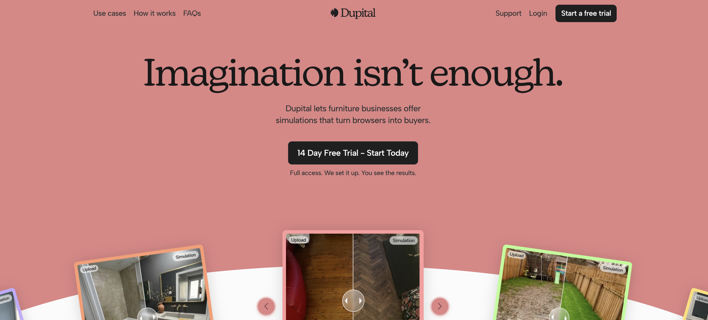
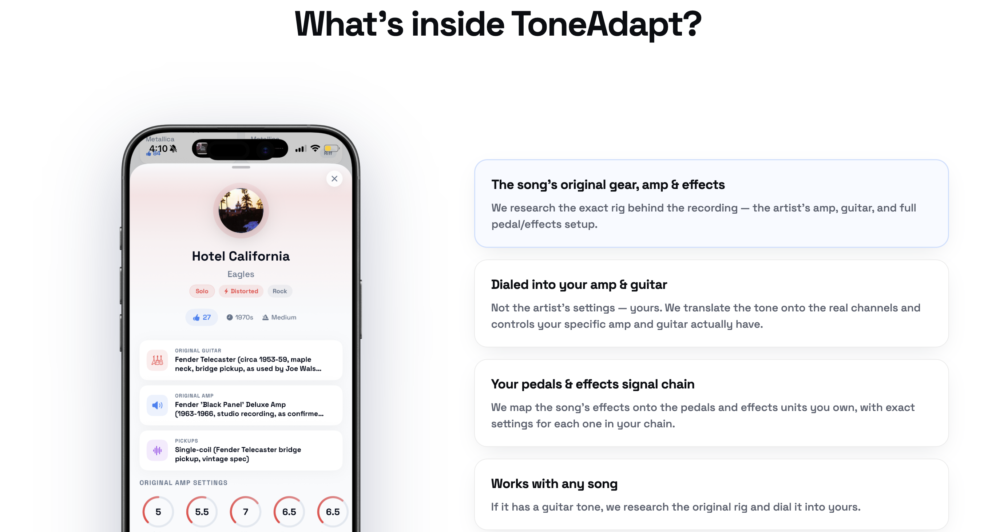
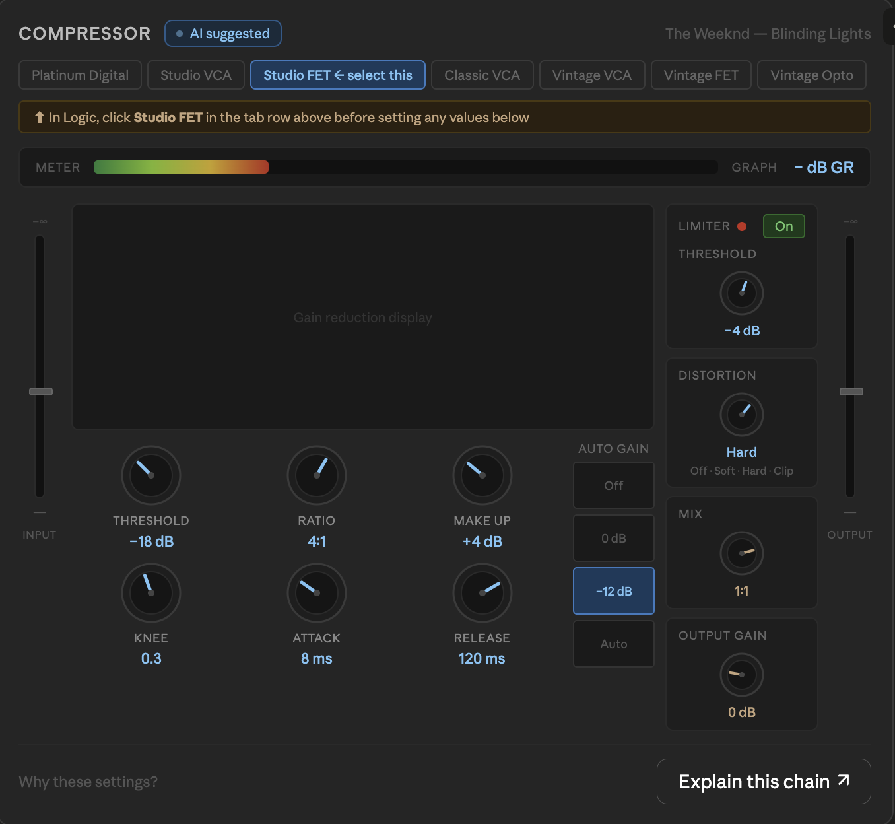

## Inspiration for website design

# The goal is to have a premium feel

landing-pages/

I like the format of this landing page, with relevant buttons at the top, central hero and an image 
  [Landing_page_layout_1](Inspiration.md)

I like the format of explaining 'What is inside Vocaligner' with possible an image of the EQ settings to the left of the explanation.

The following page should include a 'Your Vocal Chains' showing the vocal chains researched and saved that can be accessed at any time from the app

https://elevenlabs.io/ - I like this as overall inspiration, it looks clean and feels premium
typography/

colour/
Sunset orange yellow that fades into white across the page

animations/
https://linear.app/ - I like how the landing page loads in, fades in from the top down

plugin-ui/

